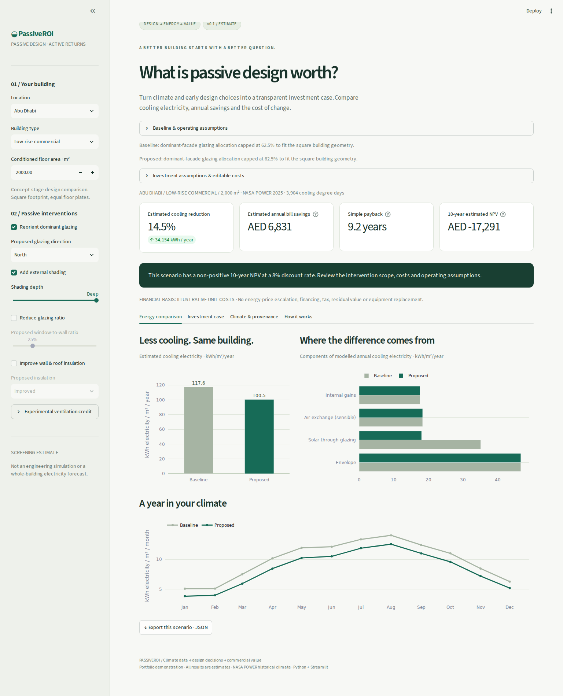
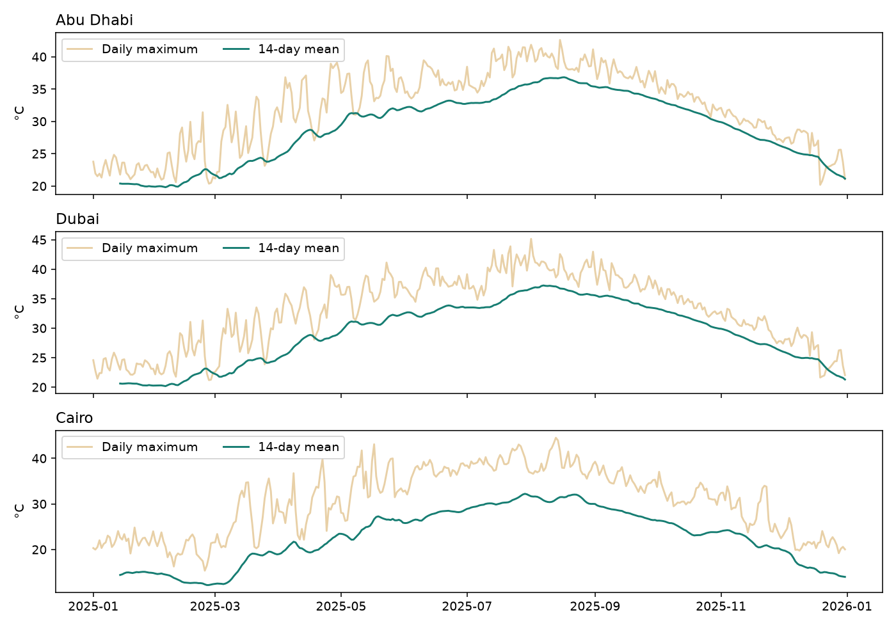

# PassiveROI

**Climate data → design decisions → commercial value.**

A Python/Streamlit portfolio project that estimates how early passive-design choices affect sensible cooling electricity and investment returns. Compare orientation, shading, glazing ratio and insulation, then inspect annual savings, simple payback and discounted NPV.

**Status:** working local v0.1; 27 automated checks pass and desktop browser flows have been checked. Source code is published on GitHub; Streamlit deployment is pending. **There is no live public URL yet.** Sourced local CAPEX ranges remain an evidence gap; the app clearly labels demo budgets and accepts project quotes.



## The problem

Early design decisions commit buildings to years of operating costs, but the commercial implications are often invisible at concept stage. Developers need a transparent way to explore whether a passive-design intervention warrants more detailed analysis.

PassiveROI connects open historical climate data to a readable heat-gain model, then converts estimated electricity savings into a financial case. It demonstrates environmental analytics, model engineering and investment reasoning using reproducible, non-confidential scenarios. It makes its assumptions and evidence gaps visible rather than presenting false engineering precision.

## Run locally

Python 3.11+; tested on Python 3.12. Run these commands inside this folder:

```bash
python3 -m venv .venv
source .venv/bin/activate
python -m pip install -r requirements.txt
python -m streamlit run app.py
```

On Windows replace the activation command with `.venv\Scripts\activate`.
Open the localhost address printed by Streamlit. Real NASA climate caches are included, so normal app use needs no API key and makes no weather requests. The first dependency installation requires internet access.

## What works

- Abu Dhabi, Dubai and Cairo; complete 2025 NASA POWER weather caches with provenance and checksums.
- Villa, low-rise commercial and mid-rise residential scenarios with editable baseline geometry and use assumptions.
- Component-based sensible cooling model: conduction, glazing solar gains, sensible air exchange and internal gains; constant COP conversion.
- NASA hourly solar data transposed to four facades with pvlib; physically capped glazing allocation.
- Before/after and monthly charts; climate inspection; annual cash flows and discounted cash flows.
- Configurable local tariffs, cost rates, total project quote, maintenance, investment horizon and discount rate.
- JSON scenario export and climate CSV download.
- Input rejection, regression tests, interface checks, MIT licence and a ready-to-run GitHub Actions workflow.

## Sample estimates

Commercial archetype, 2,000 m², 40% glazing, COP 3. West-to-north dominant glazing + deep external shading. Legacy insulation remains unchanged. Financial assumptions: illustrative budgets, 10 years, 8%, zero incremental maintenance. These are reproducible scenario examples, not building forecasts.

| City | Baseline kWhₑ/m²/yr | Proposed kWhₑ/m²/yr | Reduction | Annual bill savings | Payback years | 10-year NPV |
|---|---:|---:|---:|---:|---:|---:|
| Abu Dhabi | 117.6 | 100.5 | 14.5% | AED 6,831 | 9.2 | AED -17,291 |
| Dubai | 119.2 | 101.7 | 14.7% | AED 15,408 | 4.1 | AED 40,261 |
| Cairo | 75.1 | 59.5 | 20.8% | EGP 87,389 | 8.7 | EGP -171,129 |

Negative NPV remains visible. Simple payback can occur within the horizon while discounted NPV remains negative. Reproduce these figures with `python data/sample_outputs.py`; exact outputs are in [sample-outputs.json](docs/sample-outputs.json).

## Method and evidence

See [methodology.md](methodology.md) for every numerical default, equation, reference and limitation. Climate data and tariff references are sourced. Historical Dubai envelope U-values inform the improved tier; other design/use inputs are clearly labelled scenario assumptions. **The shading factors and demo CAPEX rates are not sourced local performance/cost estimates.** They must not be mistaken for verified claims.

The financial model places CAPEX at time zero and discounts equal net savings at year-end. Hand-calculated checks cover NPV, zero discount, zero/negative savings, maintenance and free interventions. Payback uses net annual savings before discounting.

### Zawaya comparison

The brief supplied cooling demand of 625.5 → 363.2 kWh/m²/year, equivalent to 41.93%. The original public post and simulation inputs were not independently retrieved. The [notebook](notebooks/validation.ipynb) therefore treats it as an owner-supplied comparator.

A Cairo scenario changing orientation, shading and a hypothetical sensible ventilation credit estimates **22.13%** reduction, a **19.80 percentage-point gap**. This is a direction/rough-scale check, **not independent validation**, and no parameters were fitted to reproduce 42%. The notebook distinguishes thermal demand from electrical energy and contains verified cell outputs. Cells were executed in-process using IPython because standalone Jupyter kernel sockets were restricted in the build environment.



## Verification and data refresh

```bash
python -m pip install -r requirements-dev.txt
python -m pytest -q
python data/sample_outputs.py
# Optional: refresh the included historical year explicitly
python data/fetch_climate.py --year 2025
```

The 27 checks cover model component conservation, COP, shading, insulation, orientation invariance, physically feasible glazing allocation, climate completeness, invalid inputs, financial edge cases and UI state changes. The real browser check covered initial rendering and the investment tab with no JavaScript errors; screenshots are bundled. Automated checks establish software behaviour, not predictive accuracy.

`notebooks/validation.ipynb` can be opened in Jupyter or VS Code after installing development dependencies. To change the app's climate year, fetch that year and update `YEAR` in `src/config.py`; there is no automatic fallback or fabricated dataset.

## Project layout

```text
app.py                         Streamlit interface
src/config.py                  Cities, archetypes, assumptions
src/climate.py                 Strict local cache loading
src/energy_model.py            Pure Python energy model
src/financial_model.py         NPV, payback, treatment-area costing
data/fetch_climate.py          One-time NASA download and transposition
data/cache/                    CSV caches and JSON provenance
data/sample_outputs.py         Reproducible scenarios
tests/                         Model and interface checks
notebooks/validation.ipynb      Climate, comparator and finance walkthrough
methodology.md                 Equations, sources and evidence gaps
docs/                          Screenshots, deployment guide, sample outputs
.github/workflows/test.yml      CI checks
```

## Deployment

[Deployment instructions](docs/deployment.md) cover GitHub and Streamlit Community Cloud. The repository root must contain `app.py`, `requirements.txt`, `src/`, and `data/cache/`. No secrets are required. A Dockerfile is included for container-based Streamlit hosting.

The public repository is https://github.com/AhmedShehata2002/passive-roi-simulator. Streamlit hosting has not yet been deployed; no live app URL is claimed. After deployment, replace this status with the real URL and confirm it in a signed-out browser.

## Limitations

- Simplified estimation tool, **not an engineering-grade energy simulation**.
- Every default has a documented provenance status; some are explicit author assumptions, not externally verified coefficients.
- Only sensible cooling is modelled. Humidity/dehumidification, thermal mass, HVAC part-load performance, roof solar absorption and non-cooling electricity are omitted.
- The 18°C default balance-temperature approach with explicit gains has structural uncertainty and potential double-counting; see methodology.
- Occupancy behaviour, equipment efficiency, microclimate and construction quality affect real performance.
- Tariffs are dated, account-specific references used as editable avoided-rate scenarios, not a complete bill calculator.
- Local sourced CAPEX, independent engineering validation, and a live deployment remain unfinished requirements.
- Portfolio/demonstration project, **not a commercial product**.

## Deliverable status

- [x] Working Streamlit code and three real historical climate caches
- [x] Energy and financial model checks
- [x] README, screenshots and methodology with explicit evidence status
- [x] Notebook with verified cell outputs
- [x] Deployment instructions and MIT licence
- [ ] Independently verified local CAPEX ranges
- [x] Public GitHub repository
- [ ] Live Streamlit URL verified while signed out
- [ ] LinkedIn announcement — intentionally deferred until publication

Code: MIT. NASA POWER data and referenced publications retain their respective source terms and attribution.
